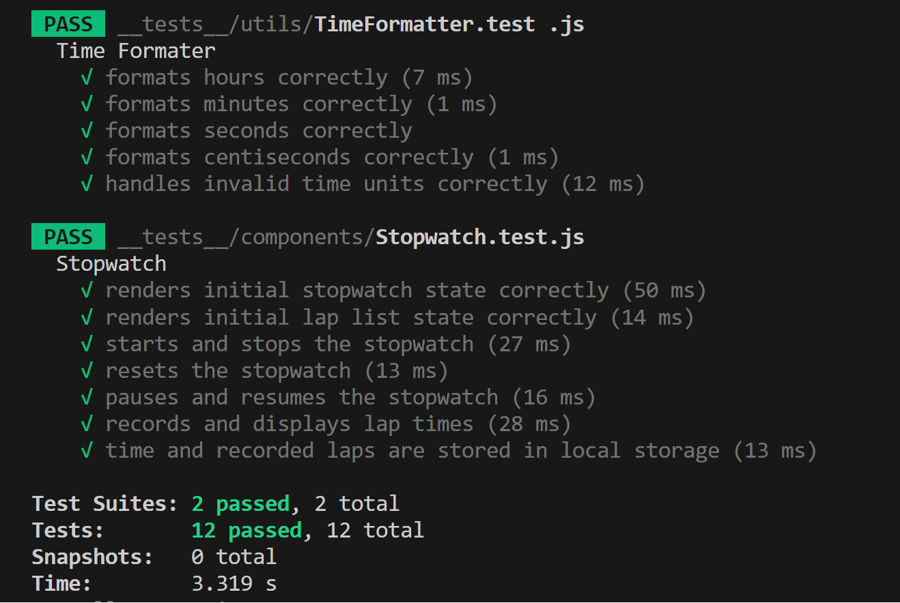

## Project Overview

The objective of this project is to implement a straightforward stopwatch application using React and TypeScript, incorporating various features for enhanced user experience and maintainability. The stopwatch boasts the following functionalities:

## Link to the published app 

**[Try Stopwatch App](https://androkzn.github.io/stopwatch_app/)**

## Main Functionality

- [x] Stopwatch timer in the format ```00:00:00:00```, representing hours:minutes:seconds:centiseconds.
- [x] Start(Resume) button: initiates (resumes) the stopwatch to begin (continue) counting time.
- [x] Pause button: pauses the stopwatch.
- [x] Reset button: resets the stopwatch to zero.
- [x] Lap button: records a lap and displays it.

**Additional Features**
- [x] Performance Visibility: Displays best (green-coloured) and worst (orange-coloured) laps.
- [x] Reload Safety: The page will reload only after the user confirms if the stopwatch is running.
- [x] Persistence of Latest Data: Time and laps are recorded and stored in a cache. Pressing the reload button does not reset the stopwatch to zero.
- [x] Responsive Design: Different layouts for different screen sizes ensure a seamless user experience.

## Changes

- **Component Modularization:** Created various separate components to enhance maintainability.
- **Media Query Support:** Added media queries to facilitate responsive design and provide different layouts for distinct screen sizes.
- **Util and Styles Folders:** Introduced utils and styles folders to modularize helper functions, enums, and styles for better maintainability.
- **Unit Test Suites:** Modified unit test suites to cover main functionality, ensuring the stopwatch functionalities work correctly.
- **Testing Dependencies:** Added ```@testing-library/jest-dom``` and ```jest-environment-jsdom``` as dev dependencies. Adjusted Jest configuration to mock styles and set the testing environment to ```jsdom```.
- **Styling Improvements:** Added ```index.css``` and modified ```index.html``` to override default styles and apply custom fonts.
- **Emotion Package Integration:** Added ```@emotion/react``` and ```@emotion/styled``` for a more convenient way to handle media queries.
- **Material-UI Integration:** Incorporated ```@mui/icons-material``` and ```@mui/material``` to provide icons and enhance the user experience.
- **Pretty-Format Dependency:** Added ```pretty-format``` for improved formatting in various project parts.

These modifications aim to improve readability, fix grammatical errors, and provide clarity regarding the reasons for adding specific features or dependencies.

## Demo


## Tests result 

